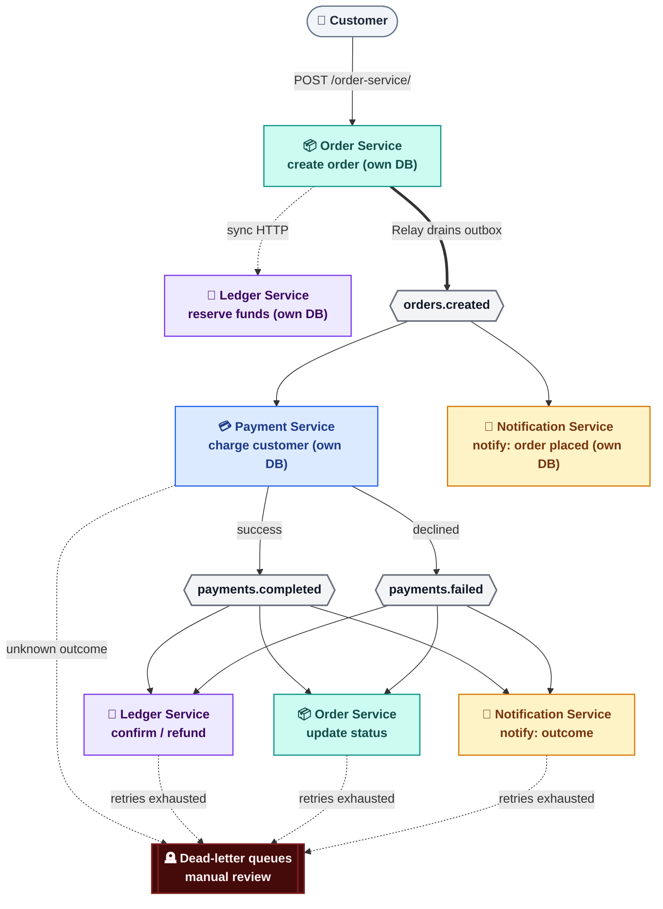

# kafka-payment-ledger

A small, deliberately production-shaped event-driven order/payment/ledger system, built with **Node.js, Kafka, and MongoDB**, to hands-on practice the failure modes that actually show up in event-driven systems — duplicate delivery, partial failures, race conditions, and recovery — rather than just "send a message, receive a message."

## Why this exists

Most Kafka tutorials stop at producer/consumer basics. This project deliberately goes further: every service is built to survive crashes, retries, duplicate messages, and ambiguous failures — the same problems that show up in real payment infrastructure, just without a real payment processor behind it.

Each service owns its **own** MongoDB database and connects to a shared Kafka broker. The only way services talk to each other is through Kafka, with one explicit, deliberate exception — see [Design Decisions](#design-decisions--trade-offs).

## Architecture



| Style                                | Meaning                                                                                    |
| ------------------------------------ | ------------------------------------------------------------------------------------------ |
| Color (teal / blue / violet / amber) | Each color = one service, used consistently everywhere it appears                          |
| Gray hexagon                         | A Kafka topic                                                                              |
| Dark double-bordered box             | Dead-letter queue (collapses the real per-service DLQ topics into one box for readability) |
| `==>` thick arrow                    | The one moment data enters Kafka (Relay draining the outbox)                               |
| `-->` thin arrow                     | Normal Kafka publish/subscribe                                                             |
| `-.->` dashed arrow                  | Exception to "everything goes through Kafka" — a sync HTTP call, or a failure path         |

A standalone **Log Service** also subscribes to every topic and prints each event to stdout — not part of the core flow, just a convenient way to watch the whole pipeline live during development or a demo.

## Services

| Service                    | Port | Owns (own MongoDB)     | Consumer group         | Listens to                                                | Publishes                                                        |
| -------------------------- | ---- | ---------------------- | ---------------------- | --------------------------------------------------------- | ---------------------------------------------------------------- |
| **Order Service**          | 8000 | `orders`, `outbox`     | `order-service`        | `payments.completed`, `payments.failed`                   | `orders.created` (via Relay)                                     |
| **Relay**                  | —    | reads Order's `outbox` | —                      | —                                                         | `orders.created`                                                 |
| **Payment Service**        | —    | `payment`, inbox       | `payment-service`      | `orders.created`                                          | `payments.completed`, `payments.failed`                          |
| **Ledger Service**         | 8001 | `ledger`, `balances`   | `ledger-service`       | `payments.completed`, `payments.failed`                   | — (exposes `POST /ledger-service/reserve`, called synchronously) |
| **Notification Service**   | —    | inbox                  | `notification-service` | `orders.created`, `payments.completed`, `payments.failed` | —                                                                |
| **Log Service** (dev tool) | —    | none                   | `log-service`          | everything                                                | —                                                                |

Kafka topics are centralized in `services/config.js`, imported by every service — so topic names are never typed as raw strings in service code.

## Event flow

1. `POST /order-service/` on **Order Service** with `{ amount, customerId, customerEmail }`.
2. Order Service synchronously calls Ledger's `POST /ledger-service/reserve` — atomically checks and decrements available balance in one operation. If insufficient, the order is rejected before anything is created.
3. If reserved, Order Service writes the order and an `outbox` row in one Mongo transaction.
4. **Relay** (a separate process, `relay-service.js`) polls the outbox every 5 seconds and publishes pending rows to `orders.created`, marking them sent only after Kafka confirms.
5. **Payment Service** consumes `orders.created`, checks its inbox for duplicates, and attempts a simulated charge: success → `payments.completed`; definite decline → `payments.failed` immediately; unknown outcome → retries with backoff, then `orders.created.dlq` for manual review.
6. **Ledger Service** confirms the existing reservation on success, or inserts a compensating credit and reverses the original debit on failure.
7. **Order Service**'s second consumer flips order status from `in_process` to `completed`/`failed`, guarded so only an `in_process` order can transition — safe against redelivery without an inbox table.
8. **Notification Service** independently fans out from all three topics.

## Design decisions & trade-offs

**Transactional outbox, not a direct Kafka call from the request handler.** Calling Kafka directly inside the order-creation route creates the dual-write problem. Writing an outbox row in the same Mongo transaction as the order, then letting a separate Relay drain it, guarantees the event is never lost even if Kafka is briefly unreachable.

**Idempotency keyed on business identity, where possible, not message delivery.** A duplicate-message guard (Kafka header `eventId`, checked against an inbox collection) only protects against the same Kafka message being redelivered. A business-level guard — keying off what actually happened (this order, this action) rather than which message carried it — also catches duplicates caused by application bugs, not just transport retries. Ledger Service does this with a unique index on a constructed key — `reserve-${orderId}` for the debit, `refund-${orderId}` for the credit — so each action is independently guarded against repeating, without the two ever colliding with each other.

**Funds are reserved atomically, not checked-then-decremented.** `findOneAndUpdate({ customerId, balance: { $gte: amount } }, { $inc: { balance: -amount } })` makes the check and the mutation one atomic database operation, closing the race where two concurrent orders could both read a sufficient balance before either debit applies.

**Known failures and unknown failures are handled differently.** A definite decline is a final answer — straight to `payments.failed`, no retry. An ambiguous failure is retried, then parked in a dead-letter queue for manual reconciliation rather than guessed at, since auto-publishing a refund or completion for an unknown outcome risks getting it wrong in either direction.

**One synchronous call, by design.** Order Service calls Ledger's `/reserve` directly over HTTP rather than via Kafka, because a balance check needs strong, immediate consistency. Everything else stays event-driven; this is the one deliberate exception.

**MongoDB instead of an RDBMS.** Kafka's failure-handling patterns (outbox, inbox, idempotent writes) are database-agnostic — MongoDB's multi-document transactions (replica-set mode) support them just as well as a relational database would.

## Tech stack

Node.js · Express · Mongoose (MongoDB) · KafkaJS · Docker Compose (Kafka in KRaft mode) · Kafka UI

## Project structure

```
services/
├── config.js                      (shared: topic names, statuses, retry config)
├── order-service/
│   ├── index.js                    Express server + Kafka consumer (status updates)
│   ├── relay-service.js            standalone outbox-draining process
│   ├── docker-compose.yml          Kafka + Kafka UI
│   ├── src/db/models/               order.js, outbox.js
│   ├── src/kafka/                   index.js, controllers.js
│   ├── src/ledgerClient.js
│   └── src/routers/order.js
├── payment-service/
│   ├── index.js                    Kafka consumer + producer
│   ├── dlqConsumer.js               standalone DLQ logger
│   ├── src/error.js                 PaymentDeclinedError
│   └── src/db/models/               payment.js, inboxEvent.js
├── ledger-service/
│   ├── index.js                    Express server + Kafka consumer
│   ├── src/db/models/               balance.js, ledger.js
│   ├── src/routers/ledger.route.js
│   └── src/utils.js                 eventId helpers
├── notification-service/
│   ├── index.js                    Kafka consumer + producer
│   ├── src/kafka.js                 per-topic handlers
│   └── src/db/models/inbox.js
└── log-service/
    └── index.js                     logs every event to stdout
```

## Running locally

MongoDB is **not** included in the Docker Compose file — only Kafka and Kafka UI are. Start Mongo separately as a single-node replica set (required for transactions):

```bash
mongod --replSet rs0
mongosh --eval "rs.initiate()"   # one-time
```

Then bring up Kafka:

```bash
docker compose -f services/order-service/docker-compose.yml up -d
```

Create a `.env` file at the **repo root** (each service loads it via `../../.env`):

```
ORDER_SERVICE_MONGO_DB_URI=mongodb://localhost:27017/order-service?replicaSet=rs0
PAYMENT_SERVICE_MONGO_DB_URI=mongodb://localhost:27017/payment-service?replicaSet=rs0
LEDGER_SERVICE_MONGO_DB_URI=mongodb://localhost:27017/ledger-service?replicaSet=rs0
NOTIFICATION_SERVICE_MONGO_DB_URI=mongodb://localhost:27017/notification-service?replicaSet=rs0
ORDER_SERVICE_PORT=8000
LEDGER_SERVICE_PORT=8001
```

The Kafka broker is currently hardcoded as `localhost:9094` in every service (not env-configurable yet).

Seed a balance manually before placing an order — there's no endpoint for this yet:

```js
// in the ledger-service database
db.balances.insertOne({ customerId: "cust-1", balance: 500 });
```

Start each service in its own terminal:

```bash
cd services/order-service && npm install && node index.js && node relay-service.js
cd services/payment-service && npm install && node index.js && node dlqConsumer.js
cd services/ledger-service && npm install && node index.js
cd services/notification-service && npm install && node index.js
cd services/log-service && npm install && node index.js   # optional — watches everything
```

Kafka UI: `http://localhost:8080`.

### Try it

```bash
curl -X POST http://localhost:8000/order-service/ \
  -H "Content-Type: application/json" \
  -d '{"amount": 50, "customerId": "cust-1", "customerEmail": "test@example.com"}'
```

## Known limitations (deliberately scoped out)

- **No automated DLQ reconciliation.** Dead-letter messages need a human to review and decide the real outcome.
- **Single-entry, not true double-entry bookkeeping.** Only one customer-side balance is tracked, for simplicity.
- **No TTL on stuck reservations.** A reservation that succeeds but is never confirmed or refunded stays held indefinitely.
- **No materialized view via Kafka Streams/ksqlDB.** Ledger Service derives balance state by hand instead of via a KTable.
- **Single Kafka broker, single Mongo node.** No replication or infrastructure-level fault tolerance.

## Possible next steps

- Add a reconciliation consumer that drains the DLQ and resolves "unknown" outcomes automatically.
- Migrate Order Service's outbox table from MongoDB to PostgreSQL, as a contained example of an incremental migration.
- Chaos test: run two instances of Payment Service's consumer, kill one mid-processing, observe the consumer group rebalance in Kafka UI.
- Optional schema tidy-up: replace Ledger Service's string-prefixed `eventId` (`reserve-${orderId}` / `refund-${orderId}`) with a `type` field plus a compound `{ orderId, type }` index. Not a correctness fix — the current approach works — just makes the "one debit, one credit per order" rule visible directly in the schema instead of living only in a helper function, and gives `type` enum validation for free.
